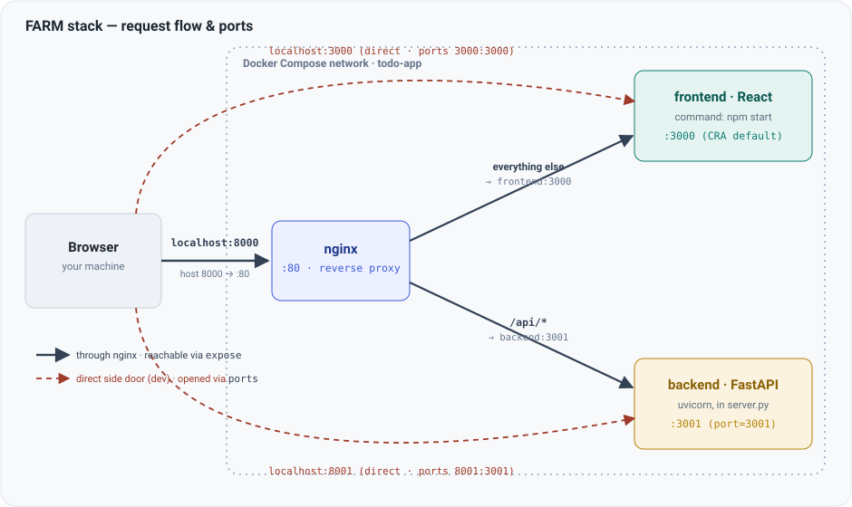

# FARM Stack To-Do App

A to-do application built on the FARM stack: **F**astAPI, **R**eact, and **M**ongoDB, with nginx in front as a reverse proxy and Docker Compose tying the services together.

## Project Layout

```
farm-stack-course/
├── backend/          # FastAPI service
│   ├── Dockerfile
│   ├── pyproject.toml
│   ├── requirements.txt
│   └── src/
│       ├── server.py # app, routes, lifespan (Mongo client)
│       └── dal.py    # data access layer
├── frontend/         # React app (Create React App)
├── nginx/            # reverse proxy config
├── compose.yaml      # nginx + frontend + backend
└── .env              # MONGODB_URI (not committed)
```

## Architecture

Three services run together under Docker Compose. **nginx** is the front door: the browser only ever talks to it, and it forwards each request to the right service based on the URL path.



The **solid** arrows are the normal path — the browser hits `localhost:8000`, nginx receives it on port 80 and fans out to the frontend and backend. The **dashed** arrows are two extra "side doors" Docker Compose opens straight to a single service, skipping nginx — handy for debugging one service in isolation.

### How nginx routes (`nginx/nginx.conf`)

nginx listens on port 80 and splits traffic by path:

| Request path | Forwarded to | Why |
| --- | --- | --- |
| `/api/...` | `backend:3001` | every FastAPI route is prefixed `/api` (see `server.py`) |
| everything else | `frontend:3000` | the React app and its assets |

Because the browser sees the frontend and the API at the **same origin** (`localhost:8000`, differing only by path), there are no CORS problems — which is why the frontend's axios calls use relative URLs like `/api/lists` and the backend needs no CORS middleware. The `Upgrade`/`Connection` headers on the frontend route exist to let Create React App's WebSocket hot-reload work through the proxy.

The names `frontend` and `backend` in `nginx.conf` are the **service names** from `compose.yaml` — Docker Compose runs an internal DNS that resolves them to the right container.

### How each service opens its door (`compose.yaml`)

A container's port is private by default. Two Compose keys open it up, and they open it to *different audiences*:

- **`expose:`** makes the port reachable **only by other containers** on the same network — this is what lets **nginx** reach the services internally.
- **`ports:`** additionally opens the port to **your machine**. It reads `HOST:CONTAINER` — traffic flows left to right, from your machine *into* the container.

**backend** — from `compose.yaml`:

```yaml
backend:
  expose:
    - "3001"          # nginx can reach backend:3001 over the internal network
  ports:
    - "8001:3001"     # your machine's 8001 → container's 3001 (the direct side door)
```

**frontend** — from `compose.yaml`:

```yaml
frontend:
  expose:
    - "3000"          # nginx can reach frontend:3000 over the internal network
  ports:
    - "3000:3000"     # your machine's 3000 → container's 3000 (the direct side door)
```

So `expose` feeds the **nginx path**, and `ports` feeds the **direct side doors** in the second diagram above. The two direct mappings are development conveniences (e.g. `http://localhost:8001/docs` for FastAPI's API docs); in production you would usually drop them so nginx is the only way in.

### Where the port numbers are defined inside each service

The Compose file above only *references* 3000 and 3001 — it doesn't decide them. Each number is actually set inside its own service:

- **Backend `3001`** is chosen explicitly in **`backend/src/server.py`**: `uvicorn.run("server:app", host="0.0.0.0", port=3001, ...)`. That single line is where the FastAPI server truly binds. Everything else that says 3001 — the Dockerfile's `EXPOSE 3001`, and both compose lines above — is just kept in sync with it. Change that line and you must change the rest to match.
- **Frontend `3000`** is **not set anywhere in this project** — it's the built-in default of Create React App's dev server (started by `command: "npm start"` → `react-scripts start`). The compose lines simply accommodate that default. To override it, set a `PORT` env var on the frontend service (e.g. `environment: [ "PORT=3005" ]`).

## Building the Project From Scratch

These are the steps used to construct this project. If you're cloning it, skip to [Running the App](#running-the-app).

### 1. Create the directory structure

```bash
mkdir farm-stack-course
cd farm-stack-course
mkdir backend frontend
cd backend
```

### 2. Create a virtual environment

```bash
python3 -m venv venv
source venv/bin/activate     # Windows: venv\Scripts\activate
```

Add `/venv` to `backend/.gitignore` so the environment never gets committed.

### 3. Add a Dockerfile

`backend/Dockerfile` installs the pinned dependencies and runs the server on port 3001:

```dockerfile
FROM python:3

WORKDIR /usr/src/app
COPY requirements.txt ./

RUN pip install --no-cache-dir --upgrade -r ./requirements.txt

EXPOSE 3001

CMD [ "python", "./src/server.py" ]
```

### 4. Add pyproject.toml

`backend/pyproject.toml` points pytest at the source directory so tests can import from `src/` without path hacks:

```toml
[tool.pytest.ini_options]
pythonpath = "src"
```

### 5. Install the dependencies

```bash
pip install "fastapi[all]" "motor[srv]" beanie aiostream
```

| Package | Why |
| --- | --- |
| `fastapi[all]` | The web framework, plus uvicorn, pydantic settings, and the other optional extras |
| `motor[srv]` | Async MongoDB driver. The `srv` extra pulls in `dnspython`, needed for `mongodb+srv://` connection strings (e.g. Atlas) |
| `beanie` | Async ODM built on top of motor — gives you document models over MongoDB |
| `aiostream` | Utilities for working with async streams |

### 6. Pin the dependencies

```bash
pip freeze > requirements.txt
```

The Dockerfile installs from this file, so regenerate it whenever you add a package.

## Running the App

### Configure the database connection

`compose.yaml` requires a `.env` file at the repo root. The backend reads `MONGODB_URI` from the environment and will fail to start without it:

```bash
MONGODB_URI=mongodb+srv://<user>:<password>@<cluster>/<database>
```

`.env` is gitignored — don't commit credentials.

### Start everything

```bash
docker compose up --build
```

| Service | URL |
| --- | --- |
| App (through nginx) | http://localhost:8000 |
| Frontend (direct) | http://localhost:3000 |
| Backend (direct) | http://localhost:8001 |

The backend runs with `DEBUG=true` under Compose, which enables FastAPI's debug mode and uvicorn's auto-reload. Both `backend/` and `frontend/` are bind-mounted, so code changes take effect without a rebuild — rebuild only when `requirements.txt` changes.

### Running the backend on its own

```bash
cd backend
source venv/bin/activate
MONGODB_URI=... DEBUG=true python src/server.py
```
